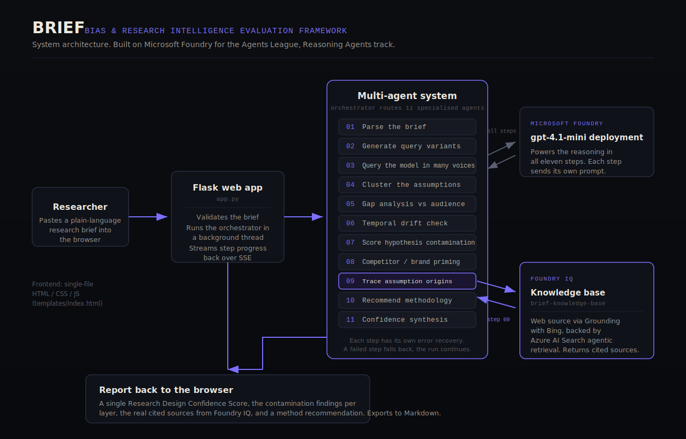

# BRIEF

### Bias & Research Intelligence Evaluation Framework

**An agent that audits what AI already assumes about a research topic, before any fieldwork begins.**

Originally built for the Microsoft Agents League hackathon (Reasoning Agents track) on Microsoft Foundry, where it won the Hack for Good award. This version runs on the OpenAI API only, so it needs one API key and no Azure subscription.

---

## Why I built this

I am a market researcher. A growing part of my job, and my colleagues' jobs, now starts with an AI model: asking it to summarise a category, suggest hypotheses, or sketch an audience before we design a study.

I kept noticing the same quiet failure. The model's answer is never neutral, and if you build research around it without realising that, you spend a lot of money confirming an assumption instead of discovering anything. I wanted a tool that made that risk visible before the work started, written by someone who actually sits in the research chair rather than guessing at what researchers need. BRIEF is that tool.

---

## The problem

When a researcher leans on an AI model to frame a topic, the model reflects whatever dominated its training data: usually Western, urban, commercial, English-language sources. Two things then go wrong. The research tends to confirm what the model already believed. And the respondents themselves have often been exposed to the same narratives, so even their answers echo the consensus back.

The result is expensive research that validates a starting assumption rather than discovering anything new. The contamination is invisible, because nobody mapped it.

BRIEF maps it. You paste in a research brief, and the agent works out what AI currently assumes about the topic, whose perspective dominates, which of the client's hypotheses are just AI consensus repeated back, where the picture is already out of date, and how to design the research so it finds something the model could not have told you.

---

## What it does

BRIEF takes a plain-language research brief and routes it through a multi-agent system of eleven specialised agents, coordinated by an orchestrator. The output is a structured report a researcher can act on, ending in a single Research Design Confidence Score that says how likely the study, as framed, is to surface genuine insight rather than echo the model.

The report covers:

- **What AI assumes** about the topic, drawn from querying the model in several consumer voices and persona variants
- **What AI misses** - the perspectives it over-weights, the ones it skips, and the questions nobody is asking
- **Client hypothesis contamination** - scoring how much of what the client "knows" came from AI rather than the market
- **Temporal drift** - which assumptions are likely stale given the model's training cutoff
- **Brand priming** - which brands the model raises unprompted, that respondents have probably already absorbed
- **Where the assumptions come from** - a source-origin analysis grounded in live web sources via OpenAI web search, with real citations
- **How to research it** - methodology recommendations built around the specific gaps found

---

## Architecture



## How it works: a multi-agent system

BRIEF is a multi-agent system. An orchestrator (`run_brief`) takes the brief and routes it through eleven specialised agents, each with a single job, its own domain-expert instructions, and its own structured output contract. Each agent hands its findings to the next, so the system as a whole decomposes a hard, open-ended problem ("is this research design contaminated?") into focused tasks that build on one another.

The design follows three reasoning patterns the track describes:

- **Role-based specialisation** - each agent owns one part of the problem (parsing, querying, contamination scoring, source archaeology, and so on) rather than one model trying to do everything at once.
- **Planner then executors** - the first agents parse the brief and plan how the topic should be probed; later agents execute that plan against the model and the live web.
- **Critic / synthesis** - the final agent reviews every other agent's output and produces a single Research Design Confidence Score, acting as a verifier over the whole run rather than adding another isolated finding.

```
Research brief
   |
   v
ORCHESTRATOR  (run_brief: routes the brief, passes state between agents)
   |
   1   PARSE agent          structure the brief: category, audience, objective, hypotheses
   2   GENERATE agent       work out how real people actually query this topic
   3   QUERY agent          probe the model in 6 base voices + 4 persona variants
   4   CLUSTER agent        find the dominant assumptions across every response
   5   GAP agent            compare the AI picture against the real target audience
   6   DRIFT agent          flag assumptions likely out of date
   7   CONTAMINATION agent  score each client hypothesis against AI consensus
   8   COMPETITOR agent     surface brands the model raises unprompted
   9   ARCHAEOLOGY agent    trace where the assumptions come from   [grounded by web search]
  10   METHODOLOGY agent    recommend how to research around the gaps
  11   SYNTHESIS agent      review all findings into one design-confidence score
   |
   v
Structured report
```

Each agent runs inside its own error recovery, so if one agent fails it returns a safe fallback and the orchestrator continues the run rather than the whole system breaking.

---

## Stack

- **OpenAI API**: `gpt-4.1-mini` powers all eleven agents through the Chat Completions API
- **OpenAI web search**: the archaeology agent calls the Responses API with the `web_search` tool on `gpt-5.4-mini` at low reasoning effort by default. The model plans searches, reads pages, and returns cited sources
- **Python** orchestrator and agent definitions (`agent.py`, `audit.py`, `web_grounding.py`)
- **Flask** backend (`app.py`) streaming each agent's progress live over server-sent events
- **Plain HTML, CSS and JavaScript** frontend (`templates/index.html`, `static/`), no framework, no build step

---

## How web grounding is used

The archaeology agent, which traces where a topic's assumptions originate, is the grounded agent, and it is the heart of what makes BRIEF more than a clever prompt chain.

Instead of letting the model guess where a topic's assumptions originate, BRIEF asks a reasoning model with the web search tool to search for the industry, media and academic sources that shape the topic. The model plans its own searches, reads results, and returns a synthesised answer with `url_citation` annotations. BRIEF feeds those grounded findings into its analysis and shows the real, clickable citations in the report.

This matters for research integrity. A claim about whose voices shaped a category should itself be traceable to sources, not asserted by the same model whose bias we are trying to audit.

If web search is ever unavailable, the step falls back to model-only analysis and the report shows no grounding banner, so the experience never breaks in front of a client.

---

## Using it on a live project

1. Choose **Market research** or **UX research**. UX mode changes what BRIEF extracts (product, user task), the personas it probes (mobile-only, screen reader, first-time, frustrated power user), the blind spots it checks (device, accessibility, context of use) and the methods it routes to (usability testing, diary studies, card sorting, accessibility audits). It also adds task scenarios to the outputs.
2. Paste the brief, or upload the RFP, client email thread or kick-off deck as PDF, DOCX or TXT. BRIEF finds the brief inside a long document.
3. Click **Review hypotheses**. BRIEF reads the brief and shows the category, audience, geography, who will be recruited, where fieldwork happens, and every client hypothesis it found. Edit them, add the beliefs the client said out loud but never wrote down, delete anything that is not a client belief. Everything downstream depends on this list.
4. Run the analysis. Five to seven minutes. Tick **Quick mode** for a one to two minute triage run with one AI model and no web evidence; use the full run for anything you will show a client.
5. The header has a light and dark mode switch. The choice is remembered in the browser; the first visit follows the system setting.
6. **Export** offers Word (.docx), PDF and Markdown for both the report and the guide audit. Word and PDF are designed documents built from the structured results: a cover with the score, boxed key finding and sample-fit warnings, tables for hypotheses, evidence, methods, tasks and screener, and an appendix of the AI answers. Word is the one to edit, PDF the one to send. Markdown is the plain-text copy.
7. Section 10, **Paste-ready outputs**, gives you a client challenge note, discussion guide probes per hypothesis (usability probes and task scenarios in UX mode) and screener criteria that counter the audience mismatch. Copy and edit in your own voice.

---

## Sample fit and honest scoring

BRIEF compares who the brief actually recruits, and where, against each client hypothesis. A hypothesis about older users cannot be tested on a sample aged 25 to 40; a hypothesis about people who dropped off cannot be tested on existing customers; a UK and Nigeria study with all fieldwork in London cannot speak for Nigeria. Any such mismatch appears in a red card on the summary page, caps the confidence score at 50, and is passed to the screener so the recruitment criteria fix it.

The confidence agent scores the design as the brief states it. It is told not to credit the client for methods BRIEF itself recommended.

A **Run health** card appears on the summary when something in the run needs a caveat: quick mode, no AI answers collected, web grounding that returned nothing, or a step that failed and used a fallback. The run log folder is named there.

---

## Auditing a guide or questionnaire

The second tab on the landing page takes a discussion guide, interview script, survey or usability test plan (pasted or uploaded) and, optionally, the client brief. In four steps and under two minutes it:

1. Extracts every question, probe, task and scale item in order.
2. Flags leading wording, presuppositions, hypothesis-confirming items, double-barrelled questions, loaded terms, priming from earlier items, jargon, closing too early, unbalanced scales, social desirability and, for usability tasks, instructions that name the feature. Each flag has a severity and a neutral rewrite in moderator language.
3. If a brief is supplied, checks each client hypothesis for coverage: tested, confirmed only, or untested, and proposes the missing questions.
4. Produces a clean copy of the instrument with every rewrite applied, and an exportable audit.

`tests/sample-guide.md` is a deliberately flawed guide for trying it. Q2, Q4, Q7, Q8 and Q10 should be flagged; Q1, Q5 and Q9 should not.

---

## How the scores are measured

Contamination scores are computed, not asked for. BRIEF puts each consumer question and persona variant to every probe model (default: `gpt-4.1-mini` and `gpt-5.4-mini`). A classifier then marks how every answer treats each client hypothesis: as the main cause (counts 1), as one factor among several (0.6), disputed (minus 0.5) or absent (0). The total is divided by the number of answers, and the report shows the counts per model. The explanation agent is told the measured score and must explain it with verbatim quotes.

Each client hypothesis is also grounded separately: a reasoning model with web search returns structured evidence for and against it, per country, with a verdict, source and year for every finding. Those findings feed the temporal drift, methodology and confidence agents, so the front page key finding and the risks can cite published sources. The methodology agent starts from the method stated in the brief and must say whether to keep, adjust or change it and what that costs. It which must name a country, an audience trait or a hypothesis in every recommendation and list the generic recommendations it rejected.

---

## Testing the tool

`tests/briefs.json` holds eleven briefs (ten market research, one UX) with planted biases and the flags BRIEF should raise. Run:

```bash
python evaluate.py            # all ten briefs
python evaluate.py --dry      # list the checks without calling the API
python evaluate.py ev-adoption-rural
```

The script prints PASS or MISS for every planted flag and every hypothesis that should score above 50, and writes a scorecard to `tests/results/`. A change to prompts or models counts as an improvement only if this score rises. A full run costs roughly eleven analyses of API usage. Add `--quick` for a cheap smoke test.

---

## Code layout

```
config.py          every setting, read once from the environment
llm.py             model calls, JSON-with-required-keys helper, run logging
agent.py           the twelve brief-audit agents and run_brief()
web_grounding.py   web search with citations, structured evidence per hypothesis
audit.py           the guide and questionnaire audit
documents.py       PDF, DOCX and text extraction for uploads
export.py          designed Word and PDF documents from the result data
app.py             Flask routes, sessions, server-sent progress
Dockerfile         container build; render.yaml and Procfile for PaaS hosts
templates/         index.html (markup only)
static/            css/brief.css and js/brief.js (no build step)
tests/             offline unit tests, the evaluation brief set, a sample guide
evaluate.py        runs the brief set through the tool and scores what it caught
```

Run the offline tests with `python -m unittest discover -s tests`. They use a fake model client, need no API key, and check the plumbing: step order, key passing, fallbacks, scoring arithmetic and quick mode. `evaluate.py` measures output quality against real briefs and does need a key.

---

## Inspecting a run

Every analysis writes each agent's raw output to `runs/<timestamp>/`, one JSON file per step (`01_parse.json` to `11_confidence.json`). If a step fails, an `error_<step>.json` file records why. Use these to check a score against the evidence, or to debug a run. The folder is excluded from git.

Every agent calls the model in JSON mode and checks that the required keys are present. If a key is missing the agent retries once with a correction, then fails loudly, so a bad reply can no longer pass silently downstream.

The contamination scores follow a written rubric and must be backed by quotes from the AI answers. Section 09 of the report shows all ten answers in full, and the export includes them as an appendix.

---

## Reliability and safety

- Every reasoning step has its own error recovery; one failed step cannot break the run
- Web grounding fails soft to model-only analysis
- Briefs are validated and length-capped before processing
- Sessions are cleaned up on a TTL and every run has a hard timeout
- The interface uses the Atkinson Hyperlegible typeface and honours reduced-motion preferences, so the tool is usable by researchers with dyslexia or motion sensitivity

---

## Built during the hacking window

BRIEF was built new for this hackathon. The idea grew out of a problem I keep running into in my own research work, but the multi-agent system, the orchestrator, the model deployment, the web grounding, the confidence-scoring agent, and the entire interface were all built during the event.

---

## Running it locally

```bash
pip install -r requirements.txt
```

Create a `.env` file in the project root (see `.env.example`):

```
OPENAI_API_KEY=your_key
```

Then start the app:

```bash
python app.py
```

Open `http://localhost:5000`, paste in a research brief, and run the analysis. Watch the eleven steps stream live, then read the report.

Optional settings, all with defaults:

| Variable | Default | What it does |
|---|---|---|
| `OPENAI_MODEL` | `gpt-4.1-mini` | Model for the eleven agents |
| `OPENAI_GROUNDING_MODEL` | `gpt-5.4-mini` | Reasoning model for web-grounded archaeology |
| `OPENAI_GROUNDING_EFFORT` | `low` | Reasoning effort for grounding: `low`, `medium` or `high` |
| `OPENAI_PROBE_MODELS` | `gpt-4.1-mini,gpt-5.4-mini` | Models whose answers are measured for consensus |
| `BRIEF_PASSWORD` | unset | Shared password for a hosted instance |

---

## For IT and infrastructure teams

This section is for whoever has to run BRIEF inside an organisation. It covers what the app is, what it needs, what leaves the network, and what is stored.

### What it is

A single-process Python web application. No database, no message queue, no background workers beyond threads inside the one process. State lives in process memory for 30 minutes per session and in a local `runs/` folder as JSON files. It can run on a laptop, a small VM, a container platform, or a PaaS such as Render.

### Runtime and dependencies

| Component | Requirement | Purpose |
|---|---|---|
| Python | 3.10 or newer (3.12 tested) | Runtime |
| `flask` | 3.x | Web framework and server-sent events |
| `gunicorn` | 21+ | Production WSGI server (Linux). On Windows use `waitress` or `python app.py` |
| `openai` | 1.66+ (3.x tested) | Chat Completions and Responses API client |
| `python-dotenv` | 1.x | Reads `.env` in development |
| `pypdf`, `python-docx` | 4+, 1.1+ | Text extraction from uploaded PDF and Word files |
| `reportlab` | 4+ | PDF export |

All dependencies are pure Python or ship wheels for Windows, macOS and Linux. No system packages are needed beyond Python itself. Exact versions are in `requirements.txt`; the container build in `Dockerfile` pins Python 3.12.

### External services and network

The only external service is the OpenAI API. Outbound HTTPS to `api.openai.com` on port 443 must be allowed. Nothing else is called: no analytics, no CDN, no fonts, no telemetry. If the organisation routes AI traffic through a gateway, set `OPENAI_BASE_URL` in the environment and the `openai` client will use it.

Endpoints used:

- `POST /v1/chat/completions` for the twelve agents and the classifier (`gpt-4.1-mini` and `gpt-5.4-mini` by default)
- `POST /v1/responses` with the `web_search` tool for grounding (`gpt-5.4-mini` by default). This is the one call that causes OpenAI to fetch public web pages on the app's behalf.

A full brief analysis makes roughly 45 API calls; a guide audit makes three to five; quick mode skips web search and uses one model.

### Data flow and retention

- **What leaves the network:** the brief or guide text the user pastes or uploads, and the text of the AI answers it generates, are sent to OpenAI inside API requests. Under OpenAI's API terms this data is not used to train models and is retained by OpenAI for up to 30 days for abuse monitoring, or zero days if the organisation has a zero-data-retention agreement. Confirm the current terms for the account in use.
- **What is stored locally:** every run writes one JSON file per agent to `runs/<timestamp>/` on the host, containing the inputs and outputs of that agent, including the brief text. This is the audit trail that makes scores traceable. Rotate or delete the folder on a schedule that matches the organisation's retention policy, or set `BRIEF_RUN_LOG_DIR` to a mounted volume. Nothing else is written to disk.
- **What is stored in memory:** session results for 30 minutes (`SESSION_TTL_SECONDS`), then discarded.
- **Uploaded files** are read into memory, converted to text, and discarded. The file itself is not saved.
- **Exports** (Word, PDF, Markdown) are generated on request and streamed to the browser; they are not saved on the server.

### Authentication and access

The app has one optional shared password (`BRIEF_PASSWORD`, HTTP Basic). It has no user accounts, roles, or SSO. For anything beyond a small trusted group, put it behind the organisation's existing reverse proxy or identity-aware proxy (Azure AD Application Proxy, Cloudflare Access, an OAuth2 proxy) and leave `BRIEF_PASSWORD` unset. The app trusts whatever reaches it, so do not expose it to the public internet without one of these in front.

### Configuration

All settings are environment variables, read once at start by `config.py`. `.env.example` lists them. The two that matter for adoption:

- `OPENAI_API_KEY`: use a key from an organisation-owned OpenAI account or project, not a personal one, so spend limits, data terms and revocation sit with the organisation.
- `BRIEF_PASSWORD`: set it, or front the app with a proxy.

Optional: `OPENAI_MODEL`, `OPENAI_PROBE_MODELS`, `OPENAI_GROUNDING_MODEL`, `OPENAI_GROUNDING_EFFORT`, `OPENAI_GROUNDING_TIMEOUT`, `BRIEF_RUN_LOG_DIR`.

### Running it

Any host that can run a Python process works. Three tested paths:

**Container**

```bash
docker build -t brief .
docker run -p 8000:8000 -e OPENAI_API_KEY=... -e BRIEF_PASSWORD=... -v brief-runs:/app/runs brief
```

**Render or similar PaaS**: `render.yaml` and `Procfile` are included. The start command is the same as the container's.

**Bare VM or laptop**: `pip install -r requirements.txt` then `gunicorn -w 1 --threads 8 --timeout 1000 app:app` (Linux or macOS) or `python app.py` (any OS, development server).

Constraints to respect:

- **One worker process only.** Sessions are in memory. A second process cannot see them and users will get "unknown session" errors. Scale by giving the one process more threads or more memory, not by adding processes. If more than one instance is ever needed, the session store needs to move to Redis or a database first; it is a small class in `app.py` designed for that.
- **Long requests.** A full analysis streams progress for five to seven minutes over one HTTP connection. Set proxy and load balancer idle timeouts to at least 15 minutes for the `/progress/` path, and disable response buffering for it (the app sends the `X-Accel-Buffering: no` header for nginx).
- **Resources.** Under 300 MB of memory and negligible CPU; the work happens at OpenAI. A 0.5 vCPU, 512 MB instance is enough for a team.

`GET /health` returns `{"status": "ok"}` for liveness checks.

### Cost

Usage is billed by OpenAI per token. Observed on real briefs: roughly 30 to 60 pence per full analysis with two probe models and web grounding, about a tenth of that for quick mode or a guide audit. Set a monthly spend limit on the OpenAI project before sharing the link.

### Moving to Azure OpenAI

The tool started life on Microsoft Foundry and the code keeps that door open. All model calls go through one client in `llm.py`; switching to Azure OpenAI is a change to that client's constructor and the model names, roughly ten lines. Web grounding would need an Azure equivalent (Azure AI Search or Bing grounding), which is the larger piece.

### Licence and third parties

The repository has no licence file yet; add one before sharing beyond the organisation (MIT is the usual choice for a tool like this). Dependencies are BSD, MIT and Apache licensed. No proprietary components. Web-grounded evidence quotes and links public sources; the report attributes each finding to its source and links to it.

---

## Deploying for colleagues

The repo includes a `render.yaml` and a `Procfile`. On Render:

1. Create a new Blueprint from this repo, or a Web Service with the start command in the `Procfile`.
2. Set `OPENAI_API_KEY` and `BRIEF_PASSWORD` in the environment settings.
3. Share the URL and the password.

Run one gunicorn worker only. Sessions live in process memory, so a second worker cannot see them. The `render.yaml` and `Procfile` already set this. A free Render instance sleeps after 15 minutes without traffic and takes about a minute to wake.

---

## Try it with this brief

> We are conducting research for a global beverage brand exploring consumer attitudes toward health and wellness drinks among Gen Z adults aged 18 to 25. The client believes Gen Z prioritises natural ingredients and sustainability above taste and price. Research will be conducted across the UK, US, and India.

BRIEF will flag the Anglo-centric framing, score the client's "natural and sustainable" hypothesis for contamination, surface the brands the model raises unprompted, and ground its source analysis in live web citations about the beverage category.

---

## Roadmap

Explored during the event and deferred for after submission:

- **Multi-market divergence** - running the chain per market and surfacing where the AI picture diverges across geographies
- **Living brief** - re-running the audit as a brief evolves, tracking how contamination changes over time
- **Fieldwork calibration** - comparing the AI assumptions against real fieldwork results to score how well BRIEF predicted the gaps

---

## A note on purpose

BRIEF was built for market research, but the same problem reaches anywhere people use AI to frame a question before investigating it: healthcare, public policy, financial inclusion. Wherever a study's starting assumptions quietly come from a model rather than the world, the findings risk confirming the model instead of the reality. Making those assumptions visible before the work begins is a small contribution to research integrity.
